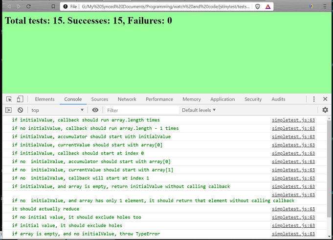

Thanks for taking a look at my unit test code examples from my recent coursework. Inside the ```tests``` folder above, you'll find JavaScript unit tests for functions I wrote as part of my studies. A description of these functions can be found below.

An enhanced version of a framework called tinytest by joewalnes found [here](https://github.com/joewalnes/jstinytest) is used to easily run the tests in each file. To run the tests, simply clone this repo to your machine and open any of the files in a browser. Opening the console in Chrome developer tools will show individual test outcome logs like this:



array_functions
---------------

I've rewritten of most of JavaScript's baked-in array functions with hand-made versions and tested them. The code for these serves as a good example of my unit testing abilities. The tests cover typical and edge cases described in the MDN documentation for the functions. My favorites are splice, reduce, and unshift.

isPrototypeOf
-------------

This inheritance function checks if an object is the child of another object. Assuming that an object and its parent object are compared, the function will return true. The function will also traverse an inheritance hierarchy to check if an object's prototype is the same as a parent object's prototype in scenarios where there is more than one degree of separation in the lineage hierarchy.

librariesOOO
------------

This function loads libraries with dependencies and can accommodate declarations of libraries even if the definitions of their dependencies have yet to be performed. The name of the function ```librariesOOO``` is short for libraries-out-of-order. The tests first declare a library with dependencies that have yet to be defined. But instead of halting with an error, the function makes note of the dependencies that have yet to be defined. When those dependencies are finally defined, the function identifies this event and proceeds to create the library with the one or more previously undefined dependencies.
